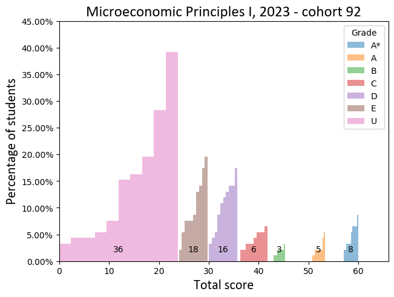

# Examples #

## Usage ##

The intended use of is to `pip`-install the code in this repository as a package.
For installation and usage follow the following steps:

1. In a bash terminal call

    ```bash
    python3 -m pip install git+https://github.com/raj-open/grades.git#egg=grades
    ```

2. Within the [./examples](.) folder call

    ```bash
    python3 examples/example.py
    ```

Alternative, esp. for those who prefer to work with the code in an open source manner (e.g. to modify parts of it),
one can clone the repository and run the example script as follows:

1. Clone or download this repository.

2. Install the requirements via

    ```bash
    python3 -m pip install -r requirement.txt
    ```

    or `just build-requirements`
    or `just build`
    for those with the [justfile](https://github.com/casey/just) tool.[^1]

3. In the [./examples](.) folder run

      ```bash
      python3 examples/example_open_source.py
      ```

## Outputs ##

Running the examples should generate from our [mock data](./data/example-data.csv)
the following plots in the [./examples/out](out) folder:




---

[^1]: This step is only needed once.
